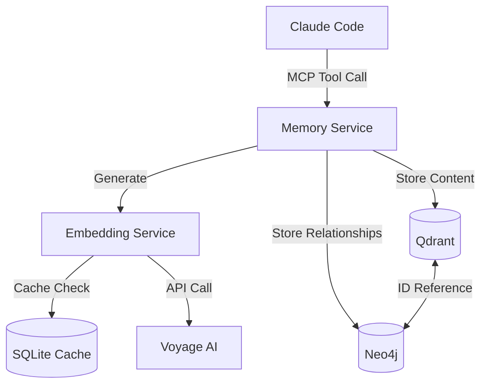
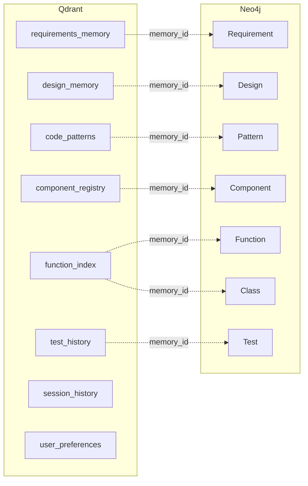

# Design Document: Data Architecture

## Document Control

| Field | Value |
|-------|-------|
| Version | 1.0 |
| Status | Draft |
| Sequence | 002 |
| Component | Data Layer |

---

## 1. Introduction

### 1.1 Purpose

This document defines the data architecture for the Claude Code Long-Term Memory System, including memory schemas, Qdrant vector collections, Neo4j graph schema, and data consistency patterns. It establishes the authoritative data model that all other system components depend upon.

### 1.2 Scope

**Included:**
- Eight memory type schemas with full field definitions
- Qdrant collection design and configuration
- Neo4j node and relationship definitions
- Cross-store reference patterns
- Data consistency and integrity mechanisms
- Data lifecycle management

**Excluded:**
- Application logic using the data (see 20-backend-design.md)
- API data transfer formats (see 50-integration-design.md)
- Storage infrastructure provisioning (see 60-infrastructure-design.md)

### 1.3 Requirements Traceability

| Requirement ID | Requirement Summary | Design Section |
|----------------|---------------------|----------------|
| REQ-MEM-FN-001 | Four-tier memory architecture | 3.1 |
| REQ-MEM-FN-003 | Episodic memory in Qdrant | 7.2 |
| REQ-MEM-FN-004 | Semantic memory hybrid storage | 7.2, 8.2 |
| REQ-MEM-FN-005 | Procedural memory storage | 7.2 |
| REQ-MEM-FN-010-017 | Memory type schemas | 5.2 |
| REQ-MEM-FN-043 | Relationship tracking in Neo4j | 8.3 |
| REQ-MEM-FN-064 | Relationship extraction storage | 8.3 |
| REQ-MEM-DATA-001 | Base memory schema | 5.2.1 |
| REQ-MEM-DATA-002 | UUID format | 5.2.1 |
| REQ-MEM-DATA-010-017 | Memory type schemas | 5.2.2-5.2.9 |
| REQ-MEM-DATA-020-022 | Graph schema | 8.2-8.5 |
| REQ-MEM-DATA-030-032 | Data integrity | 11.1-11.3 |
| REQ-MEM-DATA-040-042 | Data retention | 13.1-13.3 |
| REQ-MEM-INT-061 | Qdrant collections with 1024 dimensions | 7.2 |
| REQ-MEM-INT-062 | HNSW indexing parameters | 7.4 |
| REQ-MEM-INT-071 | Neo4j node types | 8.2 |
| REQ-MEM-INT-072 | Neo4j relationship types | 8.3 |
| REQ-MEM-INT-073 | Bidirectional references | 11.1 |

---

## 2. Data Context

### 2.1 Data Domain Overview

The memory system stores knowledge extracted from software development activities. Data flows from Claude Code interactions into persistent storage, supporting future context retrieval, duplicate detection, and design alignment validation.

### 2.2 Data Producers

| Producer | Data Created | Frequency | Volume |
|----------|--------------|-----------|--------|
| Claude Code (MCP) | All memory types | Per interaction | 1-100 memories/session |
| Indexer | Function index, component registry | Per file change | 10-1000 items/index |
| Normalizer | Merged/cleaned memories | On demand | Full store rebuild |

### 2.3 Data Consumers

| Consumer | Data Accessed | Access Pattern | Latency Requirement |
|----------|---------------|----------------|---------------------|
| Query Engine | All memory types | Read-heavy | < 500ms |
| Duplicate Detector | Function index | Read-heavy | < 300ms |
| Design Validator | Design, requirements | Read-heavy | < 500ms |
| Normalizer | All memory types | Read-Write | Batch (no latency) |

---

## 3. Conceptual Data Model

### 3.1 Memory Tiers (Letta/MemGPT Pattern)

The system implements a four-tier cognitive memory hierarchy:

| Tier | Storage | Purpose | Example |
|------|---------|---------|---------|
| Working Memory | Context window | Immediate context | Current tool response |
| Episodic Memory | Qdrant | Specific events, sessions | "Session 5: Implemented AuthService" |
| Semantic Memory | Qdrant + Neo4j | Facts, patterns, abstractions | Code patterns, component definitions |
| Procedural Memory | Qdrant + Neo4j | Workflows, rules | "When implementing agent, extend BaseAgent" |

### 3.2 Memory Types

| Memory Type | Tier | Primary Store | Graph Node |
|-------------|------|---------------|------------|
| Requirements | Semantic | Qdrant | Requirement |
| Design | Semantic | Qdrant | Design |
| Code Pattern | Procedural | Qdrant | Pattern |
| Component Registry | Semantic | Qdrant | Component |
| Function Index | Semantic | Qdrant | Function, Class |
| Test History | Episodic | Qdrant | Test |
| Session History | Episodic | Qdrant | Session |
| User Preferences | Procedural | Qdrant | - |

### 3.3 Entity Relationships

```mermaid
erDiagram
    REQUIREMENT ||--o{ DESIGN : implements
    DESIGN ||--o{ COMPONENT : specifies
    COMPONENT ||--o{ FUNCTION : contains
    COMPONENT ||--o{ CLASS : contains
    FUNCTION ||--o{ FUNCTION : calls
    CLASS ||--o{ CLASS : extends
    CLASS ||--o{ CLASS : implements
    COMPONENT ||--o{ COMPONENT : depends_on
    PATTERN ||--o{ COMPONENT : used_by
    TEST ||--o{ COMPONENT : tests
    TEST ||--o{ REQUIREMENT : verifies
```

---

## 4. Storage Technology Selection

### 4.1 Storage Requirements Analysis

| Requirement | Description | Priority |
|-------------|-------------|----------|
| Semantic Search | Find similar content by meaning | Critical |
| Relationship Traversal | Follow code dependencies | Critical |
| Fast Vector Search | < 500ms for 100K vectors | Critical |
| Fast Graph Queries | < 200ms for 3-hop traversal | Critical |
| Persistence | Survive container restarts | Critical |
| Scalability | Support 1M memories | High |

### 4.2 Technology Selection

| Data Set | Storage Technology | Rationale |
|----------|-------------------|-----------|
| Memory content + embeddings | Qdrant | Purpose-built vector DB, HNSW indexing |
| Code structure + relationships | Neo4j | Industry-standard graph DB, Cypher queries |
| Embedding cache | SQLite | Lightweight, file-based persistence |

### 4.3 Technology Trade-offs

#### Qdrant

**Strengths:**
- Optimized for high-dimensional vector search
- Native support for payload filtering
- HNSW provides excellent recall/speed trade-off

**Limitations:**
- No native graph traversal
- Join operations require application logic

**Mitigation:** Use Neo4j for relationship queries, cross-reference by ID.

#### Neo4j

**Strengths:**
- Expressive Cypher query language
- Efficient multi-hop traversals
- Native vector index support (Neo4j 5+)

**Limitations:**
- Vector search less optimized than dedicated vector DB
- Higher memory footprint

**Mitigation:** Use Qdrant for primary vector search, Neo4j for relationships.

---

## 5. Memory Schemas (Qdrant)

### 5.1 Schema Overview

All memories share a base schema with type-specific extensions. Embeddings are generated using Voyage-Code-3 (1024 dimensions).

### 5.2 Schema Definitions

#### 5.2.1 Base Memory Schema

All memories include these fields:

| Field | Type | Required | Description |
|-------|------|----------|-------------|
| id | UUID (v4) | Yes | Globally unique identifier |
| type | Enum | Yes | Memory type discriminator |
| content | Text | Yes | Primary content for embedding |
| embedding | Vector[1024] | Yes | Voyage-Code-3 embedding |
| created_at | ISO8601 | Yes | Creation timestamp |
| updated_at | ISO8601 | Yes | Last modification timestamp |
| access_count | Integer | Yes | Number of retrievals (default 0) |
| importance_score | Float [0.0-1.0] | Yes | Priority for retrieval (default 0.5) |
| neo4j_node_id | String | No | Reference to Neo4j node |
| sync_status | Enum | Yes | synced/pending/failed |
| deleted | Boolean | Yes | Soft delete flag (default false) |
| deleted_at | ISO8601 | No | Soft delete timestamp |
| metadata | JSON | No | Type-specific additional data |

**Memory Type Enum:**
- `requirements`
- `design`
- `code_pattern`
- `component`
- `function`
- `test_history`
- `session`
- `user_preference`

#### 5.2.2 Requirements Memory Schema

| Field | Type | Required | Description |
|-------|------|----------|-------------|
| requirement_id | String | Yes | Pattern: REQ-XXX-NNN |
| title | Text | Yes | Requirement title |
| description | Text | Yes | Full requirement text |
| priority | Enum | Yes | Critical/High/Medium/Low |
| status | Enum | Yes | Draft/Approved/Implemented/Verified |
| source_document | String | Yes | Source file path |
| implementing_components | Array[UUID] | No | Component IDs that implement |

#### 5.2.3 Design Memory Schema

| Field | Type | Required | Description |
|-------|------|----------|-------------|
| design_type | Enum | Yes | ADR/Specification/Architecture/Interface |
| title | Text | Yes | Design document title |
| decision | Text | No | ADR decision text |
| rationale | Text | No | Reasoning for decision |
| consequences | Text | No | Trade-offs and implications |
| related_requirements | Array[String] | No | Requirement IDs addressed |
| affected_components | Array[UUID] | No | Component IDs affected |
| status | Enum | Yes | Proposed/Accepted/Deprecated/Superseded |

#### 5.2.4 Code Pattern Memory Schema

| Field | Type | Required | Description |
|-------|------|----------|-------------|
| pattern_name | Text | Yes | Human-readable name |
| pattern_type | Enum | Yes | Template/Convention/Idiom/Architecture |
| language | String | Yes | Programming language |
| code_template | Text | Yes | Template code with placeholders |
| usage_context | Text | Yes | When to apply this pattern |
| applicable_components | Array[String] | No | Component types this applies to |
| example_implementations | Array[String] | No | File paths of examples |

#### 5.2.5 Component Registry Schema

| Field | Type | Required | Description |
|-------|------|----------|-------------|
| component_id | String | Yes | Unique component identifier |
| component_type | Enum | Yes | Frontend/Backend/Agent/Library/Service/Database |
| name | Text | Yes | Component name |
| file_path | String | Yes | Primary file location |
| public_interface | JSON | No | Exported functions/classes |
| dependencies | Array[String] | No | Component IDs this depends on |
| dependents | Array[String] | No | Component IDs depending on this |
| base_pattern | UUID | No | Pattern ID if extends pattern |
| version | String | No | Semantic version |

#### 5.2.6 Function Index Schema

| Field | Type | Required | Description |
|-------|------|----------|-------------|
| function_id | UUID | Yes | Unique function identifier |
| name | Text | Yes | Function/method name |
| signature | Text | Yes | Full signature with types |
| file_path | String | Yes | Source file location |
| start_line | Integer | Yes | Starting line number |
| end_line | Integer | Yes | Ending line number |
| language | String | Yes | Programming language |
| docstring | Text | No | Documentation string |
| containing_class | UUID | No | Parent class ID |
| calls | Array[UUID] | No | Functions this calls |
| called_by | Array[UUID] | No | Functions that call this |

#### 5.2.7 Test History Schema

| Field | Type | Required | Description |
|-------|------|----------|-------------|
| test_id | UUID | Yes | Unique test identifier |
| test_name | Text | Yes | Test function/method name |
| test_file | String | Yes | Test file path |
| execution_time | ISO8601 | Yes | When test ran |
| status | Enum | Yes | Passed/Failed/Skipped/Error |
| failure_message | Text | No | Error message if failed |
| affected_component | UUID | No | Component under test |
| related_requirements | Array[String] | No | Requirement IDs verified |
| fix_applied | Text | No | Fix description |
| fix_commit | String | No | Git commit SHA |
| design_alignment_score | Float [0.0-1.0] | No | How well fix aligns with design |

#### 5.2.8 Session History Schema

| Field | Type | Required | Description |
|-------|------|----------|-------------|
| session_id | UUID | Yes | Unique session identifier |
| start_time | ISO8601 | Yes | Session start |
| end_time | ISO8601 | No | Session end |
| summary | Text | Yes | Brief session summary |
| key_decisions | Array[Text] | No | Important decisions made |
| components_modified | Array[UUID] | No | Components changed |
| memories_created | Array[UUID] | No | Memories created |
| outcome | Text | No | Session outcome description |

#### 5.2.9 User Preferences Schema

| Field | Type | Required | Description |
|-------|------|----------|-------------|
| preference_id | UUID | Yes | Unique preference identifier |
| category | Enum | Yes | CodingStyle/Naming/Framework/Tool/Convention |
| key | Text | Yes | Preference key |
| value | JSON | Yes | Preference value |
| scope | Enum | Yes | Global/Language/Project/Component |
| examples | Array[Text] | No | Code examples demonstrating |

---

## 6. Embedding Design

### 6.1 Embedding Model

| Property | Value |
|----------|-------|
| Model | Voyage-Code-3 |
| Dimensions | 1024 |
| Optimized For | Code semantic similarity |
| Max Input | 16,000 tokens |

### 6.2 Content Preparation

Before embedding generation, content is prepared:

1. **Code content:** Include docstrings, preserve structure
2. **Requirements:** Concatenate title + description
3. **Patterns:** Include template + usage context
4. **Functions:** Include signature + docstring + body summary

### 6.3 Embedding Updates

Embeddings are updated when:
- Content changes (detected via SHA-256 hash)
- Embedding model changes
- During normalization if flagged as fallback

---

## 7. Vector Database Design (Qdrant)

### 7.1 Collection Strategy

Separate collection per memory type for:
- Optimized filtering by type
- Independent scaling
- Easier maintenance

### 7.2 Collection Definitions

#### requirements_memory

**Purpose:** Store requirement documents with semantic search.

**Vector Configuration:**

| Setting | Value | Rationale |
|---------|-------|-----------|
| Dimensions | 1024 | Voyage-Code-3 output |
| Distance | Cosine | Semantic similarity |
| Index Type | HNSW | Best recall/speed |

**Payload Schema:** Base + Requirements schema fields

#### design_memory

**Purpose:** Store architectural decisions and design documents.

**Vector Configuration:** Same as requirements_memory

**Payload Schema:** Base + Design schema fields

#### code_patterns

**Purpose:** Store implementation templates and conventions.

**Vector Configuration:** Same as requirements_memory

**Payload Schema:** Base + Code Pattern schema fields

#### component_registry

**Purpose:** Store component definitions and metadata.

**Vector Configuration:** Same as requirements_memory

**Payload Schema:** Base + Component Registry schema fields

#### function_index

**Purpose:** Store function embeddings for duplicate detection.

**Vector Configuration:**

| Setting | Value | Rationale |
|---------|-------|-----------|
| Dimensions | 1024 | Voyage-Code-3 output |
| Distance | Cosine | Code similarity |
| Index Type | HNSW | Fast similarity search |

**Payload Schema:** Base + Function Index schema fields

**Indexes:**
- `file_path` (keyword) - Filter by file
- `language` (keyword) - Filter by language
- `name` (keyword) - Find by name

#### test_history

**Purpose:** Store test execution records.

**Vector Configuration:** Same as requirements_memory

**Payload Schema:** Base + Test History schema fields

**Indexes:**
- `status` (keyword) - Filter by result
- `affected_component` (keyword) - Find tests for component

#### session_history

**Purpose:** Store session summaries and decisions.

**Vector Configuration:** Same as requirements_memory

**Payload Schema:** Base + Session History schema fields

#### user_preferences

**Purpose:** Store coding style and convention preferences.

**Vector Configuration:** Same as requirements_memory

**Payload Schema:** Base + User Preferences schema fields

### 7.3 Payload Filtering

All collections support filtering on:
- `type` (memory type)
- `created_at` (timestamp range)
- `updated_at` (timestamp range)
- `deleted` (boolean)
- `sync_status` (enum)

### 7.4 Index Configuration

HNSW parameters optimized for recall:

| Parameter | Value | Impact |
|-----------|-------|--------|
| ef_construct | 200 | Build time vs recall |
| m | 16 | Memory vs recall |
| ef_search | 128 | Search time vs recall |

---

## 8. Graph Database Design (Neo4j)

### 8.1 Graph Model Overview

Neo4j stores code structure and relationships extracted during indexing. It enables traversal queries like "all callers of function X" or "components depending on module Y".

### 8.2 Node Definitions

#### Function

| Property | Type | Required | Indexed | Description |
|----------|------|----------|---------|-------------|
| memory_id | String | Yes | Yes | Qdrant memory reference |
| name | String | Yes | Yes | Function name |
| file_path | String | Yes | Yes | Source file |
| signature | String | Yes | No | Full signature |
| language | String | Yes | Yes | Programming language |

**Constraints:**
- UNIQUE on memory_id

#### Class

| Property | Type | Required | Indexed | Description |
|----------|------|----------|---------|-------------|
| memory_id | String | Yes | Yes | Qdrant memory reference |
| name | String | Yes | Yes | Class name |
| file_path | String | Yes | Yes | Source file |
| language | String | Yes | Yes | Programming language |

**Constraints:**
- UNIQUE on memory_id

#### Module

| Property | Type | Required | Indexed | Description |
|----------|------|----------|---------|-------------|
| name | String | Yes | Yes | Module/package name |
| file_path | String | Yes | Yes | Module file or directory |
| language | String | Yes | Yes | Programming language |

**Constraints:**
- UNIQUE on (file_path, language)

#### File

| Property | Type | Required | Indexed | Description |
|----------|------|----------|---------|-------------|
| path | String | Yes | Yes | Absolute file path |
| language | String | Yes | Yes | Programming language |
| content_hash | String | Yes | No | SHA-256 of content |
| indexed_at | DateTime | Yes | No | Last index time |

**Constraints:**
- UNIQUE on path

#### Component

| Property | Type | Required | Indexed | Description |
|----------|------|----------|---------|-------------|
| memory_id | String | Yes | Yes | Qdrant memory reference |
| component_id | String | Yes | Yes | Unique identifier |
| name | String | Yes | Yes | Component name |
| type | String | Yes | Yes | Component type |

**Constraints:**
- UNIQUE on memory_id
- UNIQUE on component_id

#### Requirement

| Property | Type | Required | Indexed | Description |
|----------|------|----------|---------|-------------|
| memory_id | String | Yes | Yes | Qdrant memory reference |
| requirement_id | String | Yes | Yes | REQ-XXX-NNN pattern |
| title | String | Yes | No | Requirement title |
| priority | String | Yes | Yes | Priority level |

**Constraints:**
- UNIQUE on memory_id
- UNIQUE on requirement_id

#### Design

| Property | Type | Required | Indexed | Description |
|----------|------|----------|---------|-------------|
| memory_id | String | Yes | Yes | Qdrant memory reference |
| title | String | Yes | Yes | Design document title |
| design_type | String | Yes | Yes | ADR/Specification/etc |

**Constraints:**
- UNIQUE on memory_id

#### Pattern

| Property | Type | Required | Indexed | Description |
|----------|------|----------|---------|-------------|
| memory_id | String | Yes | Yes | Qdrant memory reference |
| pattern_name | String | Yes | Yes | Pattern name |
| pattern_type | String | Yes | Yes | Template/Convention/etc |

**Constraints:**
- UNIQUE on memory_id

#### Test

| Property | Type | Required | Indexed | Description |
|----------|------|----------|---------|-------------|
| memory_id | String | Yes | Yes | Qdrant memory reference |
| test_name | String | Yes | Yes | Test name |
| test_file | String | Yes | Yes | Test file path |

**Constraints:**
- UNIQUE on memory_id

### 8.3 Relationship Definitions

#### CALLS

**Purpose:** Function call relationships.

**Direction:** Caller -> Callee

**From Node(s):** Function

**To Node(s):** Function

**Properties:**

| Property | Type | Required | Description |
|----------|------|----------|-------------|
| created_at | DateTime | Yes | When relationship was created |
| line_number | Integer | No | Line where call occurs |

**Cardinality:** N:M (functions can call many, be called by many)

#### IMPORTS

**Purpose:** Import/dependency relationships.

**Direction:** Importer -> Imported

**From Node(s):** File, Module

**To Node(s):** Module, File

**Properties:**

| Property | Type | Required | Description |
|----------|------|----------|-------------|
| created_at | DateTime | Yes | When relationship was created |
| items | List[String] | No | Specific items imported |

**Cardinality:** N:M

#### EXTENDS

**Purpose:** Class inheritance.

**Direction:** Child -> Parent

**From Node(s):** Class

**To Node(s):** Class

**Properties:**

| Property | Type | Required | Description |
|----------|------|----------|-------------|
| created_at | DateTime | Yes | When relationship was created |

**Cardinality:** N:M (multiple inheritance in some languages)

#### IMPLEMENTS

**Purpose:** Interface implementation.

**Direction:** Implementor -> Interface

**From Node(s):** Class

**To Node(s):** Class

**Properties:**

| Property | Type | Required | Description |
|----------|------|----------|-------------|
| created_at | DateTime | Yes | When relationship was created |

**Cardinality:** N:M

#### CONTAINS

**Purpose:** File/Class contains functions.

**Direction:** Container -> Contained

**From Node(s):** File, Class

**To Node(s):** Function, Class

**Properties:**

| Property | Type | Required | Description |
|----------|------|----------|-------------|
| created_at | DateTime | Yes | When relationship was created |

**Cardinality:** 1:N

#### DEPENDS_ON

**Purpose:** Component dependencies.

**Direction:** Dependent -> Dependency

**From Node(s):** Component

**To Node(s):** Component

**Properties:**

| Property | Type | Required | Description |
|----------|------|----------|-------------|
| created_at | DateTime | Yes | When relationship was created |
| dependency_type | String | No | Runtime/Build/Optional |

**Cardinality:** N:M

#### IMPLEMENTS_REQ

**Purpose:** Code implementing requirement.

**Direction:** Code -> Requirement

**From Node(s):** Component, Function, Class

**To Node(s):** Requirement

**Properties:**

| Property | Type | Required | Description |
|----------|------|----------|-------------|
| created_at | DateTime | Yes | When relationship was created |
| completeness | Float | No | Implementation completeness (0-1) |

**Cardinality:** N:M

#### FOLLOWS_DESIGN

**Purpose:** Code following design.

**Direction:** Code -> Design

**From Node(s):** Component, Function, Class

**To Node(s):** Design

**Properties:**

| Property | Type | Required | Description |
|----------|------|----------|-------------|
| created_at | DateTime | Yes | When relationship was created |

**Cardinality:** N:M

#### USES_PATTERN

**Purpose:** Code using pattern.

**Direction:** Code -> Pattern

**From Node(s):** Component, Class

**To Node(s):** Pattern

**Properties:**

| Property | Type | Required | Description |
|----------|------|----------|-------------|
| created_at | DateTime | Yes | When relationship was created |

**Cardinality:** N:M

#### TESTS

**Purpose:** Test coverage.

**Direction:** Test -> Tested

**From Node(s):** Test

**To Node(s):** Component, Function, Class

**Properties:**

| Property | Type | Required | Description |
|----------|------|----------|-------------|
| created_at | DateTime | Yes | When relationship was created |
| last_result | String | No | Passed/Failed/Skipped |

**Cardinality:** N:M

### 8.4 Graph Traversal Patterns

#### Find All Callers

**Purpose:** Find functions that call a given function.

**Starting Point:** Function node by name

**Traversal:** MATCH (caller)-[:CALLS]->(target) WHERE target.name = $name

**Result:** List of caller Functions

#### Find Dependencies Tree

**Purpose:** Find all dependencies of a component (transitive).

**Starting Point:** Component node by component_id

**Traversal:** MATCH (c)-[:DEPENDS_ON*1..5]->(dep) WHERE c.component_id = $id

**Result:** Tree of dependent Components

#### Find Implementing Code

**Purpose:** Find all code implementing a requirement.

**Starting Point:** Requirement node by requirement_id

**Traversal:** MATCH (code)-[:IMPLEMENTS_REQ]->(req) WHERE req.requirement_id = $id

**Result:** Components, Functions, Classes

#### Find Pattern Usage

**Purpose:** Find all code using a pattern.

**Starting Point:** Pattern node by pattern_name

**Traversal:** MATCH (code)-[:USES_PATTERN]->(p) WHERE p.pattern_name = $name

**Result:** Components, Classes

### 8.5 Index Strategy

| Index | Type | Node/Relationship | Properties | Purpose |
|-------|------|-------------------|------------|---------|
| idx_function_name | Lookup | Function | name | Find by name |
| idx_function_file | Lookup | Function | file_path | Find by file |
| idx_class_name | Lookup | Class | name | Find by name |
| idx_component_id | Lookup | Component | component_id | Find by ID |
| idx_requirement_id | Lookup | Requirement | requirement_id | Find by ID |
| idx_file_path | Lookup | File | path | Find by path |

---

## 9. Caching Design

### 9.1 Embedding Cache

**Purpose:** Avoid redundant Voyage API calls for previously embedded content.

**Storage:** SQLite database (memory-service-cache volume)

**Schema:**

```sql
CREATE TABLE embedding_cache (
    content_hash TEXT PRIMARY KEY,
    embedding BLOB NOT NULL,
    model TEXT NOT NULL,
    created_at TIMESTAMP NOT NULL,
    last_accessed TIMESTAMP NOT NULL,
    is_fallback BOOLEAN NOT NULL DEFAULT FALSE
);

CREATE INDEX idx_cache_accessed ON embedding_cache(last_accessed);
CREATE INDEX idx_cache_fallback ON embedding_cache(is_fallback);
```

**TTL:** 30 days since last access

**Eviction:** LRU when cache exceeds 10,000 entries (configurable)

---

## 10. Data Access Patterns

### 10.1 Access Pattern Summary

| Pattern | Storage | Operation | Frequency | Latency Target |
|---------|---------|-----------|-----------|----------------|
| Semantic search | Qdrant | Read | High | < 500ms |
| Graph traversal | Neo4j | Read | Medium | < 200ms |
| Memory add | Qdrant + Neo4j | Write | Medium | < 100ms |
| Duplicate check | Qdrant | Read | High | < 300ms |
| Index file | Qdrant + Neo4j | Write | Low | N/A (batch) |

### 10.2 Read Patterns

#### Semantic Search

**Purpose:** Find memories similar to query text.

**Storage:** Qdrant

**Query:** Vector similarity search with optional filters

**Expected Volume:** 10-50 queries per session

**Performance Target:** < 500ms P95

#### Relationship Traversal

**Purpose:** Find related entities via graph.

**Storage:** Neo4j

**Query:** Cypher MATCH with variable-length paths

**Expected Volume:** 5-20 queries per session

**Performance Target:** < 200ms P95 for 3-hop traversal

### 10.3 Write Patterns

#### Memory Creation

**Purpose:** Store new memory from Claude Code.

**Storage:** Qdrant (primary) then Neo4j (if applicable)

**Transaction Scope:** Qdrant write + Neo4j write (compensation on failure)

**Expected Volume:** 1-100 memories per session

#### Codebase Indexing

**Purpose:** Index files during scanning.

**Storage:** Qdrant (functions) + Neo4j (relationships)

**Batch Size:** 100 functions per batch

**Expected Volume:** 1,000+ files per full index

---

## 11. Data Consistency Design

### 11.1 Cross-Store References

Every Qdrant memory that has a Neo4j representation includes:
- `neo4j_node_id` in Qdrant payload
- `memory_id` property on Neo4j node

**Validation:** During normalization, verify bidirectional references exist and match.

### 11.2 Write Consistency

Following ADR-008 (Ordered Writes with Compensation):

1. Write to Qdrant (primary store)
2. Write to Neo4j (secondary store)
3. If Neo4j fails, mark Qdrant entry `sync_status: pending`
4. Background reconciliation retries pending entries

### 11.3 Conflict Resolution

**Update Conflicts:** Optimistic concurrency using `updated_at` timestamp.

**Sync Conflicts:** Most recent write wins; log discrepancies.

---

## 12. Data Synchronization

### 12.1 Sync Status States

| Status | Meaning | Action |
|--------|---------|--------|
| synced | Both stores consistent | None |
| pending | Neo4j write pending | Retry in background |
| failed | Neo4j write failed 10+ times | Manual intervention |

### 12.2 Background Sync Process

**Trigger:** Every 5 minutes

**Process:**
1. Query Qdrant for `sync_status: pending`
2. For each, attempt Neo4j write
3. Update `sync_status` on success/failure
4. Log permanently failed entries

---

## 13. Data Lifecycle Management

### 13.1 Data Retention

| Data Type | Retention Period | Archive Strategy | Deletion Method |
|-----------|------------------|------------------|-----------------|
| All memories | Indefinite | None (primary store) | Soft delete |
| Soft-deleted | 30 days | None | Hard delete during normalization |
| Embedding cache | 30 days unused | None | LRU eviction |
| Neo4j relationships | Matches Qdrant | None | Cascade on node delete |

### 13.2 Soft Delete

Deleted memories are marked with:
- `deleted: true`
- `deleted_at: <timestamp>`

Soft-deleted entries:
- Excluded from search results (filter: `deleted: false`)
- Retained for 30 days
- Permanently removed during normalization

### 13.3 Audit Trail

All memory modifications logged with:
- Operation type (create/update/delete)
- Previous values (for updates)
- Modification timestamp
- Request context (tool invocation ID)

---

## 14. Performance Design

### 14.1 Performance Goals

| Operation | Target Latency | Target Throughput | Conditions |
|-----------|----------------|-------------------|------------|
| Vector search | < 500ms P95 | 100 QPS | 100K vectors |
| Graph traversal | < 200ms P95 | 50 QPS | 3-hop depth |
| Memory write | < 100ms P95 | 50 WPS | Excluding embedding |
| Duplicate check | < 300ms P95 | 100 QPS | 10K functions |

### 14.2 Capacity Planning

| Storage | Current Size | Growth Rate | 1-Year Projection | Scaling Strategy |
|---------|--------------|-------------|-------------------|------------------|
| Qdrant | 0 | 10K memories/month | 120K memories | Vertical (more RAM) |
| Neo4j | 0 | 50K nodes/month | 600K nodes | Vertical (more RAM) |
| SQLite cache | 0 | 1K entries/day | 10K entries (capped) | LRU eviction |

---

## 15. Security Design

### 15.1 Data Classification

| Data | Classification | Handling Requirements |
|------|----------------|----------------------|
| Source code in embeddings | Confidential | No external transmission except Voyage |
| Memory content | Internal | Docker volume encryption |
| Relationship graph | Internal | Docker volume encryption |

### 15.2 Access Control

| Storage | Authentication | Authorization Model |
|---------|----------------|---------------------|
| Qdrant | API key (optional) | Service account |
| Neo4j | Username/password | Service account |
| SQLite | File permissions | Container user |

---

## 16. Constraints and Assumptions

### 16.1 Technical Constraints

| Constraint | Source | Impact on Design |
|------------|--------|------------------|
| Single user | Requirements | No multi-tenant considerations |
| Docker volumes | Requirements | Persistence via named volumes |
| Voyage-Code-3 | Requirements | 1024 dimensions, external API |
| 8GB minimum RAM | Requirements | Qdrant 4GB + Neo4j 2GB + Service 2GB |

### 16.2 Assumptions

| Assumption | Rationale | Risk if Invalid |
|------------|-----------|-----------------|
| Vector search is primary | Most queries are semantic | Would need to optimize graph queries |
| Relationships are derivable | Parsed from code | Complex manual relationships unsupported |
| Memory growth is linear | Developer workstation | May need sharding at scale |

---

## 17. Glossary

| Term | Definition |
|------|------------|
| Cosine Similarity | Distance metric measuring angle between vectors |
| Embedding | Dense vector representation of semantic content |
| HNSW | Hierarchical Navigable Small World algorithm for ANN search |
| Payload | Qdrant term for metadata stored with vectors |
| Soft Delete | Marking as deleted without physical removal |

---

## Appendix A: Supporting Diagrams

### A.1 Data Flow Diagram



### A.2 Collection Relationship Diagram



---

## Appendix B: Reference Documents

| Document | Version | Relevance |
|----------|---------|-----------|
| requirements-memory-docs.md | 1.0 | Source requirements |
| ADR-002-memory-storage-partitioning.md | Accepted | Storage decision |
| ADR-008-cross-store-synchronization.md | Accepted | Sync strategy |
| Qdrant Documentation | Latest | Vector DB reference |
| Neo4j Documentation | 5.x | Graph DB reference |
