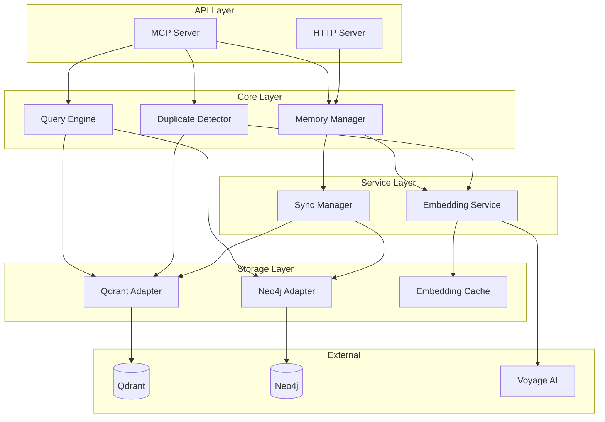

# Design Document: Backend Services

## Document Control

| Field | Value |
|-------|-------|
| Version | 1.0 |
| Status | Draft |
| Sequence | 002 |
| Component | Core Services |

---

## 1. Introduction

### 1.1 Purpose

This document defines the backend services for the Claude Code Long-Term Memory System, including the Memory Service (MCP server), storage adapters (Qdrant, Neo4j), embedding service, query engine, and core business logic components.

### 1.2 Scope

**Included:**
- MCP Server (stdio transport)
- HTTP Server (health/metrics)
- Memory Manager (CRUD operations)
- Query Engine (semantic, graph, hybrid)
- Duplicate Detector
- Storage Adapters (Qdrant, Neo4j)
- Embedding Service (Voyage integration)

**Excluded:**
- Background workers (see 40-agent-design.md)
- MCP tool specifications (see 50-integration-design.md)
- Infrastructure deployment (see 60-infrastructure-design.md)

### 1.3 Requirements Traceability

| Requirement ID | Requirement Summary | Design Section |
|----------------|---------------------|----------------|
| REQ-MEM-FN-020 | Self-editing memory tools | 5.1 |
| REQ-MEM-FN-021 | Memory extraction | 8.2 |
| REQ-MEM-FN-022 | Conflict detection | 8.2 |
| REQ-MEM-FN-024 | Importance scoring | 8.2 |
| REQ-MEM-FN-030-033 | Duplicate detection | 5.3 |
| REQ-MEM-FN-080-084 | Query and retrieval | 5.2 |
| REQ-MEM-INT-001 | MCP compliance | 3.2 |
| REQ-MEM-INT-004 | Concurrent invocations | 10.1 |
| REQ-MEM-INT-060-063 | Qdrant interface | 5.5.1 |
| REQ-MEM-INT-070-074 | Neo4j interface | 5.5.2 |
| REQ-MEM-INT-080-084 | Voyage interface | 5.4 |
| REQ-MEM-PERF-001-006 | Performance targets | 10.1 |
| REQ-MEM-REL-001-005 | Reliability | 11.1-11.5 |

---

## 2. System Context

### 2.1 Service Overview

The Memory Service is the core backend that:
- Receives MCP tool invocations from Claude Code via stdio
- Exposes health/metrics endpoints via HTTP
- Manages memory lifecycle (CRUD)
- Executes semantic and graph queries
- Detects code duplicates
- Orchestrates cross-store operations

### 2.2 Client Applications

| Client | Description | Primary Use Cases |
|--------|-------------|-------------------|
| Claude Code | Primary consumer via MCP | All memory operations |
| Prometheus | Metrics scraping | Observability |
| Docker Compose | Health checks | Container orchestration |

### 2.3 External Dependencies

| Dependency | Type | Description | Impact if Unavailable |
|------------|------|-------------|----------------------|
| Qdrant | Database | Vector storage | System offline |
| Neo4j | Database | Graph storage | Relationship queries fail gracefully |
| Voyage AI | Service | Embedding generation | Use cached/fallback embeddings |

---

## 3. Architectural Design

### 3.1 Architectural Overview

The backend follows a layered architecture (per ADR-007):

```
+------------------+
|   API Layer      |  MCP Server, HTTP Server
+------------------+
         |
+------------------+
|   Core Layer     |  MemoryManager, QueryEngine, DuplicateDetector
+------------------+
         |
+------------------+
|  Service Layer   |  EmbeddingService
+------------------+
         |
+------------------+
|  Storage Layer   |  QdrantAdapter, Neo4jAdapter, SyncManager
+------------------+
```

### 3.2 Design Principles

#### Stateless Service

**Definition:** No in-memory state between requests.

**Application:** All state persisted in Qdrant/Neo4j; service can restart without data loss.

#### Fail-Fast Validation

**Definition:** Validate inputs at boundary, fail immediately.

**Application:** Pydantic validation on all MCP tool inputs.

#### Graceful Degradation

**Definition:** Partial functionality when dependencies unavailable.

**Application:** Neo4j down = vector queries work, graph queries fail.

### 3.3 Key Architectural Decisions

#### Decision 1: Dual Transport (ADR-001)

- **Context:** Need MCP for Claude Code, observability for ops.
- **Decision:** stdio for MCP, HTTP for health/metrics.
- **Consequences:** Two server components, minimal complexity.

#### Decision 2: Query Planner (ADR-005)

- **Context:** Hybrid queries span Qdrant and Neo4j.
- **Decision:** Query planner decomposes to optimal execution.
- **Consequences:** Two round trips for hybrid, but optimal per-store.

### 3.4 Request Processing Pipeline

```
MCP Request (stdio)
        |
        v
+-------------------+
| Protocol Handler  |  Parse MCP message
+-------------------+
        |
        v
+-------------------+
| Tool Router       |  Dispatch to tool handler
+-------------------+
        |
        v
+-------------------+
| Input Validation  |  Pydantic schema
+-------------------+
        |
        v
+-------------------+
| Core Service      |  Business logic
+-------------------+
        |
        v
+-------------------+
| Storage Layer     |  Qdrant/Neo4j ops
+-------------------+
        |
        v
+-------------------+
| Response Format   |  MCP response
+-------------------+
```

---

## 4. API Design

### 4.1 MCP Server Interface

**Protocol:** MCP (Model Context Protocol)

**Transport:** stdio

**Format:** JSON-RPC 2.0

### 4.2 HTTP Server Interface

**Framework:** FastAPI

**Endpoints:**

| Path | Method | Purpose |
|------|--------|---------|
| /health | GET | Liveness check |
| /health/ready | GET | Readiness check (all deps) |
| /metrics | GET | Prometheus metrics |
| /status | GET | Detailed system status |

### 4.3 Health Endpoint

```python
@app.get("/health")
async def health():
    return {"status": "healthy"}

@app.get("/health/ready")
async def ready(
    qdrant: QdrantAdapter = Depends(),
    neo4j: Neo4jAdapter = Depends(),
):
    qdrant_ok = await qdrant.health_check()
    neo4j_ok = await neo4j.health_check()

    if qdrant_ok and neo4j_ok:
        return {"status": "ready", "qdrant": "ok", "neo4j": "ok"}

    return JSONResponse(
        status_code=503,
        content={
            "status": "not_ready",
            "qdrant": "ok" if qdrant_ok else "unavailable",
            "neo4j": "ok" if neo4j_ok else "unavailable",
        }
    )
```

---

## 5. Component Design

### 5.1 Memory Manager

#### Responsibility

Manages memory lifecycle: create, read, update, delete operations across all memory types.

#### Interface

```python
class MemoryManager:
    """Memory lifecycle management."""

    async def add_memory(
        self,
        memory_type: MemoryType,
        content: str,
        metadata: dict,
        relationships: list[Relationship] = None,
    ) -> UUID:
        """Create new memory."""
        ...

    async def get_memory(self, memory_id: UUID) -> Optional[BaseMemory]:
        """Retrieve memory by ID."""
        ...

    async def update_memory(
        self,
        memory_id: UUID,
        content: Optional[str] = None,
        metadata: Optional[dict] = None,
    ) -> BaseMemory:
        """Update existing memory."""
        ...

    async def delete_memory(self, memory_id: UUID) -> bool:
        """Soft-delete memory."""
        ...

    async def bulk_add_memories(
        self,
        memories: list[dict],
    ) -> list[UUID]:
        """Batch memory creation."""
        ...
```

#### Internal Structure

```python
class MemoryManager:
    def __init__(
        self,
        qdrant: QdrantAdapter,
        neo4j: Neo4jAdapter,
        embedding_service: EmbeddingService,
        sync_manager: SyncManager,
    ):
        self.qdrant = qdrant
        self.neo4j = neo4j
        self.embedding = embedding_service
        self.sync = sync_manager

    async def add_memory(self, memory_type, content, metadata, relationships=None):
        # 1. Generate embedding
        embedding = await self.embedding.get_embedding(content)

        # 2. Create memory model
        memory = create_memory_model(memory_type, content, metadata)

        # 3. Store in Qdrant
        memory_id = await self.qdrant.upsert(
            collection=memory_type.value,
            id=memory.id,
            vector=embedding,
            payload=memory.model_dump(),
        )

        # 4. Create Neo4j node (if applicable)
        if self._needs_graph_node(memory_type):
            try:
                node_id = await self.neo4j.create_node(memory)
                await self.qdrant.update_payload(
                    collection=memory_type.value,
                    id=memory_id,
                    payload={"neo4j_node_id": node_id, "sync_status": "synced"},
                )
            except Neo4jError:
                await self.sync.mark_pending(memory_id)

        # 5. Create relationships
        if relationships:
            await self._create_relationships(memory_id, relationships)

        return memory_id
```

### 5.2 Query Engine

#### Responsibility

Plans and executes queries across Qdrant (semantic) and Neo4j (graph), including hybrid queries.

#### Interface

```python
class QueryEngine:
    """Query planning and execution."""

    async def semantic_search(
        self,
        query: str,
        memory_types: Optional[list[MemoryType]] = None,
        time_range: Optional[TimeRange] = None,
        limit: int = 10,
        min_similarity: float = 0.0,
    ) -> list[SearchResult]:
        """Semantic similarity search."""
        ...

    async def graph_query(
        self,
        cypher: str,
        params: Optional[dict] = None,
    ) -> list[dict]:
        """Execute Cypher query."""
        ...

    async def get_related(
        self,
        entity_id: str,
        relationship_types: Optional[list[str]] = None,
        direction: Direction = Direction.BOTH,
        depth: int = 1,
    ) -> list[RelatedEntity]:
        """Graph traversal."""
        ...

    async def hybrid_search(
        self,
        query: str,
        graph_constraint: GraphConstraint,
        limit: int = 10,
    ) -> list[HybridResult]:
        """Combined semantic + graph search."""
        ...
```

#### Query Planning

```python
class QueryPlanner:
    """Determines optimal query execution strategy."""

    def plan(self, query: HybridQuery) -> ExecutionPlan:
        # Analyze query structure
        has_semantic = query.text is not None
        has_graph = query.graph_constraint is not None

        if has_semantic and not has_graph:
            return VectorOnlyPlan(query)

        if has_graph and not has_semantic:
            return GraphOnlyPlan(query)

        # Hybrid query - determine primary store
        if self._is_graph_selective(query.graph_constraint):
            return GraphFirstPlan(query)
        else:
            return VectorFirstPlan(query)

    def _is_graph_selective(self, constraint: GraphConstraint) -> bool:
        """Estimate if graph constraint is highly selective."""
        # Specific component ID = selective
        # Relationship type only = not selective
        return constraint.entity_id is not None
```

#### Result Ranking

```python
def compute_ranking_score(result: SearchResult) -> float:
    """Combine multiple factors for final ranking."""
    weights = {
        'similarity': 0.5,
        'importance': 0.2,
        'recency': 0.1,
        'access_frequency': 0.1,
        'relationship': 0.1,
    }

    recency_decay = math.exp(-0.1 * result.days_since_update)
    access_norm = min(result.access_count / 100, 1.0)
    rel_score = 1 / (1 + result.hop_distance) if result.hop_distance else 0

    return (
        weights['similarity'] * result.similarity +
        weights['importance'] * result.importance_score +
        weights['recency'] * recency_decay +
        weights['access_frequency'] * access_norm +
        weights['relationship'] * rel_score
    )
```

### 5.3 Duplicate Detector

#### Responsibility

Identifies semantically similar functions to prevent code duplication.

#### Interface

```python
class DuplicateDetector:
    """Code duplicate detection."""

    async def find_duplicates(
        self,
        code: str,
        language: str,
        threshold: float = 0.85,
        limit: int = 5,
    ) -> list[DuplicateMatch]:
        """Find similar functions in index."""
        ...

    async def check_function(
        self,
        signature: str,
        body: str,
        threshold: float = 0.85,
    ) -> Optional[DuplicateMatch]:
        """Check if function has duplicates."""
        ...
```

#### Implementation

```python
class DuplicateDetector:
    def __init__(
        self,
        qdrant: QdrantAdapter,
        embedding_service: EmbeddingService,
    ):
        self.qdrant = qdrant
        self.embedding = embedding_service

    async def find_duplicates(
        self,
        code: str,
        language: str,
        threshold: float = 0.85,
        limit: int = 5,
    ) -> list[DuplicateMatch]:
        # Generate embedding for input code
        embedding = await self.embedding.get_embedding(code)

        # Search function_index collection
        results = await self.qdrant.search(
            collection="function",
            vector=embedding,
            filter={"language": language, "deleted": False},
            limit=limit,
            score_threshold=threshold,
        )

        return [
            DuplicateMatch(
                function_id=r.id,
                name=r.payload["name"],
                file_path=r.payload["file_path"],
                signature=r.payload["signature"],
                similarity=r.score,
            )
            for r in results
        ]
```

### 5.4 Embedding Service

#### Responsibility

Manages embedding generation with caching, batching, and fallback handling.

#### Interface

```python
class EmbeddingService:
    """Embedding generation with caching."""

    async def get_embedding(self, text: str) -> list[float]:
        """Get embedding for single text (uses cache)."""
        ...

    async def batch_embed(self, texts: list[str]) -> list[list[float]]:
        """Batch embedding generation."""
        ...

    async def preload_cache(self, texts: list[str]) -> None:
        """Preload embeddings into cache."""
        ...
```

#### Implementation (per ADR-003)

```python
class EmbeddingService:
    def __init__(
        self,
        voyage_client: VoyageClient,
        cache: EmbeddingCache,
        fallback: Optional[LocalEmbedder] = None,
    ):
        self.voyage = voyage_client
        self.cache = cache
        self.fallback = fallback
        self._batch_queue = asyncio.Queue()
        self._batch_processor = None

    async def get_embedding(self, text: str) -> list[float]:
        # Compute content hash for cache key
        content_hash = compute_content_hash(normalize_content(text))

        # Check cache
        cached = await self.cache.get(content_hash)
        if cached is not None:
            return cached

        # Generate embedding
        try:
            embedding = await self.voyage.embed(text)
            await self.cache.put(content_hash, embedding, is_fallback=False)
            return embedding
        except VoyageError:
            if self.fallback:
                embedding = await self.fallback.embed(text)
                await self.cache.put(content_hash, embedding, is_fallback=True)
                return embedding
            raise

    async def batch_embed(self, texts: list[str]) -> list[list[float]]:
        # Separate cached vs uncached
        hashes = [compute_content_hash(normalize_content(t)) for t in texts]
        cached_results = {}
        to_embed = []
        to_embed_indices = []

        for i, (text, hash_) in enumerate(zip(texts, hashes)):
            cached = await self.cache.get(hash_)
            if cached is not None:
                cached_results[i] = cached
            else:
                to_embed.append(text)
                to_embed_indices.append(i)

        # Batch embed uncached
        if to_embed:
            try:
                embeddings = await self.voyage.batch_embed(to_embed)
                for i, embedding in zip(to_embed_indices, embeddings):
                    hash_ = hashes[i]
                    await self.cache.put(hash_, embedding, is_fallback=False)
                    cached_results[i] = embedding
            except VoyageError:
                if self.fallback:
                    embeddings = await self.fallback.batch_embed(to_embed)
                    for i, embedding in zip(to_embed_indices, embeddings):
                        hash_ = hashes[i]
                        await self.cache.put(hash_, embedding, is_fallback=True)
                        cached_results[i] = embedding
                else:
                    raise

        # Reassemble in order
        return [cached_results[i] for i in range(len(texts))]
```

### 5.5 Storage Adapters

#### 5.5.1 Qdrant Adapter

```python
class QdrantAdapter:
    """Qdrant vector database adapter."""

    def __init__(self, host: str, port: int, api_key: Optional[str] = None):
        self.client = QdrantClient(host=host, port=port, api_key=api_key)

    async def upsert(
        self,
        collection: str,
        id: UUID,
        vector: list[float],
        payload: dict,
    ) -> UUID:
        """Insert or update point."""
        await self.client.upsert(
            collection_name=collection,
            points=[
                PointStruct(
                    id=str(id),
                    vector=vector,
                    payload=payload,
                )
            ],
        )
        return id

    async def search(
        self,
        collection: str,
        vector: list[float],
        filter: Optional[dict] = None,
        limit: int = 10,
        score_threshold: float = 0.0,
    ) -> list[ScoredPoint]:
        """Vector similarity search."""
        qdrant_filter = self._build_filter(filter) if filter else None

        results = await self.client.search(
            collection_name=collection,
            query_vector=vector,
            query_filter=qdrant_filter,
            limit=limit,
            score_threshold=score_threshold,
        )
        return results

    async def get(self, collection: str, id: UUID) -> Optional[dict]:
        """Get point by ID."""
        results = await self.client.retrieve(
            collection_name=collection,
            ids=[str(id)],
            with_payload=True,
        )
        return results[0].payload if results else None

    async def update_payload(
        self,
        collection: str,
        id: UUID,
        payload: dict,
    ) -> None:
        """Update point payload."""
        await self.client.set_payload(
            collection_name=collection,
            payload=payload,
            points=[str(id)],
        )

    async def delete(self, collection: str, id: UUID) -> None:
        """Delete point."""
        await self.client.delete(
            collection_name=collection,
            points_selector=PointIdsList(points=[str(id)]),
        )

    async def health_check(self) -> bool:
        """Check Qdrant availability."""
        try:
            await self.client.get_collections()
            return True
        except Exception:
            return False

    def _build_filter(self, filter_dict: dict) -> Filter:
        """Convert dict filter to Qdrant filter."""
        conditions = []
        for key, value in filter_dict.items():
            if isinstance(value, bool):
                conditions.append(FieldCondition(
                    key=key,
                    match=MatchValue(value=value),
                ))
            elif isinstance(value, str):
                conditions.append(FieldCondition(
                    key=key,
                    match=MatchValue(value=value),
                ))
            elif isinstance(value, dict) and "gte" in value:
                conditions.append(FieldCondition(
                    key=key,
                    range=Range(gte=value.get("gte"), lte=value.get("lte")),
                ))
        return Filter(must=conditions)
```

#### 5.5.2 Neo4j Adapter

```python
class Neo4jAdapter:
    """Neo4j graph database adapter."""

    def __init__(self, uri: str, user: str, password: str):
        self.driver = GraphDatabase.driver(uri, auth=(user, password))

    async def create_node(self, memory: BaseMemory) -> str:
        """Create node from memory."""
        labels = self._get_labels(memory)
        properties = self._get_node_properties(memory)

        async with self.driver.session() as session:
            result = await session.run(
                f"CREATE (n:{':'.join(labels)} $props) RETURN elementId(n) as id",
                props=properties,
            )
            record = await result.single()
            return record["id"]

    async def update_node(self, node_id: str, properties: dict) -> None:
        """Update node properties."""
        async with self.driver.session() as session:
            await session.run(
                """
                MATCH (n) WHERE elementId(n) = $id
                SET n += $props
                """,
                id=node_id,
                props=properties,
            )

    async def delete_node(self, node_id: str) -> None:
        """Delete node and its relationships."""
        async with self.driver.session() as session:
            await session.run(
                """
                MATCH (n) WHERE elementId(n) = $id
                DETACH DELETE n
                """,
                id=node_id,
            )

    async def create_relationship(
        self,
        from_id: str,
        to_id: str,
        rel_type: str,
        properties: Optional[dict] = None,
    ) -> None:
        """Create relationship between nodes."""
        props = properties or {}
        props["created_at"] = datetime.utcnow().isoformat()

        async with self.driver.session() as session:
            await session.run(
                f"""
                MATCH (a) WHERE elementId(a) = $from_id
                MATCH (b) WHERE elementId(b) = $to_id
                CREATE (a)-[r:{rel_type} $props]->(b)
                """,
                from_id=from_id,
                to_id=to_id,
                props=props,
            )

    async def query(self, cypher: str, params: Optional[dict] = None) -> list[dict]:
        """Execute Cypher query."""
        async with self.driver.session() as session:
            result = await session.run(cypher, params or {})
            return [dict(record) for record in await result.fetch_all()]

    async def get_related(
        self,
        node_id: str,
        rel_types: Optional[list[str]] = None,
        direction: str = "BOTH",
        depth: int = 1,
    ) -> list[dict]:
        """Get related nodes via traversal."""
        rel_pattern = "|".join(rel_types) if rel_types else ""
        dir_pattern = self._direction_pattern(direction, rel_pattern)

        cypher = f"""
        MATCH (start) WHERE elementId(start) = $id
        MATCH path = (start){dir_pattern}*1..{depth}(related)
        RETURN DISTINCT related, length(path) as distance
        ORDER BY distance
        """

        return await self.query(cypher, {"id": node_id})

    async def health_check(self) -> bool:
        """Check Neo4j availability."""
        try:
            async with self.driver.session() as session:
                await session.run("RETURN 1")
            return True
        except Exception:
            return False

    def _get_labels(self, memory: BaseMemory) -> list[str]:
        """Get Neo4j labels for memory type."""
        label_map = {
            MemoryType.REQUIREMENTS: ["Requirement"],
            MemoryType.DESIGN: ["Design"],
            MemoryType.CODE_PATTERN: ["Pattern"],
            MemoryType.COMPONENT: ["Component"],
            MemoryType.FUNCTION: ["Function"],
            MemoryType.TEST_HISTORY: ["Test"],
        }
        return label_map.get(memory.type, [])

    def _get_node_properties(self, memory: BaseMemory) -> dict:
        """Extract properties for Neo4j node."""
        # Include memory_id for cross-reference
        return {
            "memory_id": str(memory.id),
            **memory.metadata,
        }

    def _direction_pattern(self, direction: str, rel: str) -> str:
        """Build direction pattern for Cypher."""
        rel_part = f":{rel}" if rel else ""
        if direction == "OUTGOING":
            return f"-[{rel_part}]->"
        elif direction == "INCOMING":
            return f"<-[{rel_part}]-"
        return f"-[{rel_part}]-"
```

### 5.6 Sync Manager

```python
class SyncManager:
    """Cross-store synchronization manager."""

    def __init__(self, qdrant: QdrantAdapter, neo4j: Neo4jAdapter):
        self.qdrant = qdrant
        self.neo4j = neo4j

    async def mark_pending(self, memory_id: UUID, collection: str) -> None:
        """Mark memory as pending sync."""
        await self.qdrant.update_payload(
            collection=collection,
            id=memory_id,
            payload={
                "sync_status": "pending",
                "sync_retry_count": 0,
                "sync_last_attempt": datetime.utcnow().isoformat(),
            },
        )

    async def process_pending(self, limit: int = 100) -> int:
        """Process pending sync entries. Returns count processed."""
        processed = 0

        for collection in COLLECTIONS:
            pending = await self.qdrant.search_by_filter(
                collection=collection,
                filter={"sync_status": "pending"},
                limit=limit,
            )

            for point in pending:
                try:
                    if point.payload.get("neo4j_node_id"):
                        # Update existing node
                        await self.neo4j.update_node(
                            point.payload["neo4j_node_id"],
                            self._extract_node_props(point.payload),
                        )
                    else:
                        # Create new node
                        node_id = await self.neo4j.create_node_from_payload(
                            collection, point.payload
                        )
                        await self.qdrant.update_payload(
                            collection=collection,
                            id=point.id,
                            payload={"neo4j_node_id": node_id},
                        )

                    await self.qdrant.update_payload(
                        collection=collection,
                        id=point.id,
                        payload={"sync_status": "synced", "sync_error": None},
                    )
                    processed += 1

                except Exception as e:
                    retry_count = point.payload.get("sync_retry_count", 0) + 1
                    status = "failed" if retry_count > 10 else "pending"
                    await self.qdrant.update_payload(
                        collection=collection,
                        id=point.id,
                        payload={
                            "sync_status": status,
                            "sync_retry_count": retry_count,
                            "sync_error": str(e),
                            "sync_last_attempt": datetime.utcnow().isoformat(),
                        },
                    )

        return processed
```

---

## 6. Data Design

### 6.1 Data Model Overview

See 02-data-architecture.md for complete schema definitions. Backend services use Pydantic models from 10-library-design.md.

### 6.2 Database Design

- **Qdrant:** Vector collections per memory type
- **Neo4j:** Knowledge graph with code structure
- **SQLite:** Embedding cache

### 6.3 Connection Pooling

```python
# Qdrant: Uses httpx connection pooling internally
qdrant_client = QdrantClient(
    host=settings.qdrant_host,
    port=settings.qdrant_port,
    timeout=30,
)

# Neo4j: Driver manages connection pool
neo4j_driver = GraphDatabase.driver(
    settings.neo4j_uri,
    auth=(settings.neo4j_user, settings.neo4j_password),
    max_connection_pool_size=50,
)
```

---

## 7. Authentication and Authorization

### 7.1 Authentication Design

No user authentication required (single-user system via stdio).

Service authentication for databases via environment variables:
- `QDRANT_API_KEY`
- `NEO4J_USER` / `NEO4J_PASSWORD`
- `VOYAGE_API_KEY`

### 7.2 Authorization Design

All operations permitted for single user. No RBAC required.

---

## 8. Business Logic Design

### 8.1 Domain Overview

The memory domain encompasses:
- **Memory lifecycle:** Create, read, update, delete
- **Query execution:** Semantic, graph, hybrid
- **Duplicate detection:** Code similarity analysis
- **Synchronization:** Cross-store consistency

### 8.2 Business Operations

#### Memory Addition

**Trigger:** `memory_add` MCP tool

**Preconditions:**
- Valid memory type
- Content not empty
- Metadata matches type schema

**Business Rules:**
1. Generate embedding from content
2. Detect conflicts with existing memories (similarity > 0.95)
3. Store in Qdrant
4. Create Neo4j node if type requires graph representation
5. Create relationships if provided

**Side Effects:**
- Qdrant point created
- Neo4j node created (optional)
- Relationships created (optional)

#### Duplicate Detection

**Trigger:** `find_duplicates` MCP tool

**Preconditions:**
- Code or description provided
- Language specified

**Business Rules:**
1. Generate embedding from code
2. Search function_index collection
3. Filter by language
4. Apply similarity threshold (default 0.85)
5. Return top matches with details

**Side Effects:** None (read-only)

#### Design Alignment Check

**Trigger:** `validate_fix` MCP tool

**Preconditions:**
- Fix description provided
- Component ID provided

**Business Rules:**
1. Retrieve component's design context
2. Find related requirements via graph
3. Compute semantic similarity between fix and design
4. Identify potential violations
5. Return alignment score and concerns

**Side Effects:** None (read-only)

---

## 9. Integration Design

### 9.1 Voyage AI Integration

```python
class VoyageClient:
    """Voyage AI API client."""

    def __init__(self, api_key: str, model: str = "voyage-code-3"):
        self.api_key = api_key
        self.model = model
        self.client = httpx.AsyncClient(
            base_url="https://api.voyageai.com/v1",
            headers={"Authorization": f"Bearer {api_key}"},
            timeout=30.0,
        )

    async def embed(self, text: str) -> list[float]:
        """Generate single embedding."""
        response = await self.client.post(
            "/embeddings",
            json={"input": text, "model": self.model},
        )
        response.raise_for_status()
        return response.json()["data"][0]["embedding"]

    async def batch_embed(self, texts: list[str]) -> list[list[float]]:
        """Generate batch embeddings (max 128)."""
        if len(texts) > 128:
            raise ValueError("Batch size exceeds limit of 128")

        response = await self.client.post(
            "/embeddings",
            json={"input": texts, "model": self.model},
        )
        response.raise_for_status()

        data = response.json()["data"]
        # Sort by index to maintain order
        data.sort(key=lambda x: x["index"])
        return [d["embedding"] for d in data]
```

### 9.2 Rate Limit Handling

```python
class RateLimitedVoyageClient(VoyageClient):
    """Voyage client with rate limit handling."""

    async def _request_with_retry(self, method: str, **kwargs):
        max_retries = 3
        base_delay = 1.0

        for attempt in range(max_retries):
            try:
                if method == "embed":
                    return await super().embed(kwargs["text"])
                else:
                    return await super().batch_embed(kwargs["texts"])
            except httpx.HTTPStatusError as e:
                if e.response.status_code == 429:
                    # Rate limited
                    retry_after = float(
                        e.response.headers.get("Retry-After", base_delay * (2 ** attempt))
                    )
                    await asyncio.sleep(retry_after)
                elif e.response.status_code >= 500:
                    # Server error, retry with backoff
                    await asyncio.sleep(base_delay * (2 ** attempt))
                else:
                    raise

        raise VoyageError("Max retries exceeded")
```

---

## 10. Performance Design

### 10.1 Performance Goals

| Metric | Target | Measurement Method |
|--------|--------|-------------------|
| Semantic search P95 | < 500ms | Prometheus histogram |
| Graph traversal P95 | < 200ms | Prometheus histogram |
| Memory write P95 | < 100ms (excl. embedding) | Prometheus histogram |
| Duplicate check P95 | < 300ms | Prometheus histogram |
| Embedding throughput | 100/sec (cached) | Prometheus counter |

### 10.2 Caching Strategy

| Cache | Scope | TTL | Invalidation Strategy |
|-------|-------|-----|----------------------|
| Embedding cache | SQLite | 30 days | LRU eviction |
| Query result cache | None | - | Not implemented (stateless) |

### 10.3 Connection Management

- Qdrant: Connection reuse via httpx
- Neo4j: Driver connection pool (50 connections)
- Voyage: httpx connection pooling

---

## 11. Reliability Design

### 11.1 Error Handling Strategy

| Error Category | Handling Approach | Client Response |
|----------------|-------------------|-----------------|
| Validation error | Immediate rejection | 400 with details |
| Qdrant unavailable | Fail fast | 503 Service Unavailable |
| Neo4j unavailable | Graceful degradation | Partial results |
| Voyage unavailable | Use fallback/cache | Best effort |
| Internal error | Log and fail | 500 with request ID |

### 11.2 Retry Policies

| Operation | Max Retries | Backoff Strategy | Circuit Breaker |
|-----------|-------------|------------------|-----------------|
| Qdrant write | 3 | Exponential (100ms, 200ms, 400ms) | No |
| Neo4j write | 3 | Exponential | No |
| Voyage API | 3 | Exponential + Retry-After | No |
| Sync reconciliation | 10 | Scheduled (5 min) | N/A |

### 11.3 Graceful Degradation

| Scenario | Behavior | Consumer Impact |
|----------|----------|-----------------|
| Neo4j unavailable | Vector queries work | No graph traversal |
| Voyage unavailable | Use cached + fallback | Lower quality embeddings |
| Embedding cache miss | Generate on demand | Higher latency |

### 11.4 Health Checks

| Endpoint | Type | Checks |
|----------|------|--------|
| /health | Liveness | Service running |
| /health/ready | Readiness | Qdrant + Neo4j reachable |

### 11.5 Timeout Configuration

| Operation | Timeout | Rationale |
|-----------|---------|-----------|
| Qdrant query | 5s | Allow for large result sets |
| Neo4j query | 5s | Allow for deep traversals |
| Voyage API | 30s | Batch embedding can be slow |
| MCP request | 60s | Total request budget |

---

## 12. Security Design

See 03-security-architecture.md for complete security design.

### 12.1 Input Validation

All MCP tool inputs validated via Pydantic:
- Type checking
- String length limits
- Enum validation
- Path sanitization

### 12.2 Secrets Management

All secrets via environment variables:
- `VOYAGE_API_KEY`
- `NEO4J_PASSWORD`
- `QDRANT_API_KEY` (optional)

---

## 13. Observability Design

### 13.1 Logging

```python
# Structured logging with context
logger.info(
    "memory_created",
    memory_id=str(memory_id),
    memory_type=memory_type.value,
    content_length=len(content),
    has_relationships=bool(relationships),
)

# Error logging with context
logger.error(
    "qdrant_write_failed",
    memory_id=str(memory_id),
    error=str(e),
    exc_info=True,
)
```

### 13.2 Metrics

| Metric | Type | Description |
|--------|------|-------------|
| memory_operations_total | Counter | Operations by type and status |
| query_duration_seconds | Histogram | Query latency by type |
| embedding_cache_hits | Counter | Cache hit/miss |
| sync_pending_count | Gauge | Pending sync entries |
| qdrant_errors_total | Counter | Qdrant errors |
| neo4j_errors_total | Counter | Neo4j errors |

### 13.3 Metrics Endpoint

```python
from prometheus_client import Counter, Histogram, Gauge, generate_latest

memory_ops = Counter(
    'memory_operations_total',
    'Memory operations',
    ['operation', 'memory_type', 'status']
)

query_duration = Histogram(
    'query_duration_seconds',
    'Query duration',
    ['query_type'],
    buckets=[0.01, 0.05, 0.1, 0.25, 0.5, 1.0, 2.5, 5.0]
)

@app.get("/metrics")
async def metrics():
    return Response(
        generate_latest(),
        media_type="text/plain; version=0.0.4"
    )
```

---

## 14. Constraints and Assumptions

### 14.1 Technical Constraints

| Constraint | Source | Impact on Design |
|------------|--------|------------------|
| Single user | Requirements | No auth/authz |
| stdio MCP | ADR-001 | Synchronous request/response |
| Python 3.12 | Requirements | async/await patterns |
| 8GB RAM | Requirements | Connection pool limits |

### 14.2 Assumptions

| Assumption | Rationale | Risk if Invalid |
|------------|-----------|-----------------|
| Qdrant always available | Primary store | Service offline |
| Embeddings cacheable | Content-addressed | Stale embeddings |
| Graph queries < 3 hops | Performance target | Slow queries |

---

## 15. Glossary

| Term | Definition |
|------|------------|
| Hybrid Query | Query combining vector similarity and graph traversal |
| Sync Status | State of cross-store synchronization |
| Fallback Embedding | Locally generated embedding when Voyage unavailable |

---

## Appendix A: Component Diagram



---

## Appendix B: Reference Documents

| Document | Version | Relevance |
|----------|---------|-----------|
| ADR-001-mcp-server-transport.md | Accepted | Transport decision |
| ADR-003-embedding-pipeline.md | Accepted | Embedding architecture |
| ADR-005-hybrid-query-engine.md | Accepted | Query planning |
| ADR-008-cross-store-synchronization.md | Accepted | Sync strategy |
