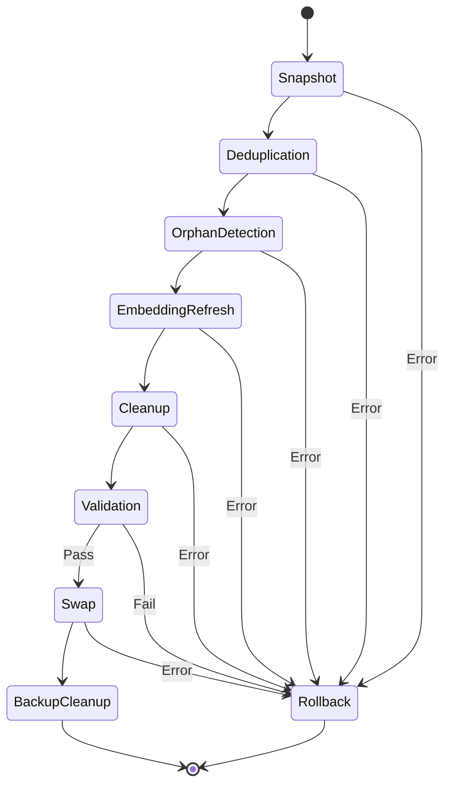

# Design Document: Background Workers (Agents)

## Document Control

| Field | Value |
|-------|-------|
| Version | 1.0 |
| Status | Draft |
| Sequence | 002 |
| Component | Worker Layer |

---

## 1. Introduction

### 1.1 Purpose

This document defines the background worker agents for the Claude Code Long-Term Memory System. These workers handle asynchronous tasks including codebase indexing, memory normalization, and cross-store synchronization.

### 1.2 Scope

**Included:**
- Indexer Worker (codebase scanning and parsing)
- Normalizer Worker (memory cleanup and optimization)
- Sync Worker (cross-store reconciliation)

**Excluded:**
- Real-time request handling (see 20-backend-design.md)
- MCP tool implementations (see 50-integration-design.md)

### 1.3 Requirements Traceability

| Requirement ID | Requirement Summary | Design Section |
|----------------|---------------------|----------------|
| REQ-MEM-FN-060 | File/directory indexing | 4.2.1 |
| REQ-MEM-FN-062 | Incremental indexing | 4.2.1 |
| REQ-MEM-FN-063 | Multi-language support | 4.2.1 |
| REQ-MEM-FN-064 | Relationship extraction | 4.2.1 |
| REQ-MEM-FN-070 | Memory normalization | 4.2.2 |
| REQ-MEM-FN-071 | Deduplication | 4.2.2 |
| REQ-MEM-FN-072 | Orphan cleanup | 4.2.2 |
| REQ-MEM-FN-073 | Embedding refresh | 4.2.2 |
| REQ-MEM-FN-074 | Rollback on failure | 4.2.2 |
| REQ-MEM-FN-075 | Progress reporting | 4.2.2 |
| REQ-MEM-PERF-005 | 1000 files/minute indexing | 11.1 |
| REQ-MEM-REL-005 | Atomic normalization | 4.2.2 |

---

## 2. Agent Context

### 2.1 Agent Overview

Background workers perform long-running tasks triggered by MCP tools or schedules:

| Worker | Trigger | Duration | Concurrency |
|--------|---------|----------|-------------|
| Indexer | MCP tool call | Minutes | Single instance |
| Normalizer | MCP tool call | Minutes-Hours | Single instance |
| Sync Worker | Scheduled (5 min) | Seconds | Single instance |

### 2.2 Agent Classification

| Characteristic | Indexer | Normalizer | Sync Worker |
|----------------|---------|------------|-------------|
| Execution Model | Event-Driven | Event-Driven | Scheduled |
| Autonomy Level | Semi-Autonomous | Semi-Autonomous | Fully Autonomous |
| Statefulness | Stateful (job) | Stateful (job) | Stateless |
| Concurrency | Single Instance | Single Instance | Single Instance |

### 2.3 External Dependencies

| Dependency | Type | Description | Impact if Unavailable |
|------------|------|-------------|----------------------|
| Qdrant | Database | Memory storage | Worker fails |
| Neo4j | Database | Relationship storage | Partial functionality |
| Voyage AI | Service | Embedding generation | Use cache/fallback |
| File System | Resource | Source code files | Indexer fails |

### 2.4 Communication Channels

| Channel | Type | Direction | Purpose |
|---------|------|-----------|---------|
| MCP Tool | Request/Response | Inbound | Start jobs |
| Status Query | Request/Response | Inbound | Check progress |
| Qdrant | Database | Bidirectional | Data operations |
| Neo4j | Database | Bidirectional | Graph operations |

---

## 3. Architectural Design

### 3.1 Architectural Overview

Workers run within the Memory Service process, sharing database connections:

```
Memory Service Process
|
+-- MCP Server Thread
|   +-- Tool handlers (trigger workers)
|
+-- Worker Thread Pool
    +-- Indexer Worker
    +-- Normalizer Worker
    +-- Sync Worker (scheduled)
```

### 3.2 Design Principles

#### Idempotency

**Definition:** Operations can be safely retried.

**Application:** Indexer reprocesses files, normalizer can restart phases.

#### Progress Tracking

**Definition:** Long operations report progress.

**Application:** Job state stored in memory, queryable via MCP tool.

#### Graceful Interruption

**Definition:** Workers can be stopped cleanly.

**Application:** Check cancellation flag between work units.

---

## 4. Agent Behavior Design

### 4.1 Worker Lifecycle

#### Startup

1. Initialize database connections (shared)
2. Register with job manager
3. Start scheduled tasks (sync worker)
4. Wait for work

#### Steady State

1. Receive job request
2. Create job record
3. Execute in background
4. Update progress
5. Complete or fail job

#### Shutdown

1. Receive shutdown signal
2. Set cancellation flag
3. Wait for current work unit to complete
4. Cleanup resources

### 4.2 Task Processing

#### 4.2.1 Indexer Worker

**Trigger:** `index_file` or `index_directory` MCP tool

**Preconditions:**
- Path exists and is readable
- Language is supported (or detectable)

**Processing Steps:**

```
1. Create index job record
   - job_id, status="running", progress=0

2. Scan files (directory mode)
   - Respect .gitignore
   - Filter by extension
   - Collect file list

3. For each file:
   a. Check if already indexed (hash comparison)
   b. If unchanged, skip
   c. Parse file (tree-sitter)
   d. Extract functions, classes, imports, calls
   e. Generate embeddings (batch)
   f. Store in Qdrant (function_index)
   g. Create Neo4j nodes (Function, Class, File)
   h. Create relationships (CALLS, IMPORTS, EXTENDS, CONTAINS)
   i. Update progress

4. Cleanup stale entries
   - Find indexed files no longer on disk
   - Mark as deleted in Qdrant
   - Remove from Neo4j

5. Complete job
   - status="completed", stats
```

**Success Criteria:**
- All files processed without error
- All relationships created

**Failure Handling:**
- Log file-level errors, continue with next file
- Update job with partial completion
- Report errors in job result

**Side Effects:**
- Qdrant: function_index entries created/updated
- Neo4j: Function, Class, File nodes and relationships

**Index State Tracking:**

```python
@dataclass
class IndexState:
    file_path: str
    content_hash: str
    indexed_at: datetime
    functions_count: int
    classes_count: int
    language: str
```

#### 4.2.2 Normalizer Worker

**Trigger:** `normalize_memory` MCP tool

**Preconditions:**
- No other normalization in progress
- Sufficient disk space (2x current size)

**Processing Steps (per ADR-006):**

```
Phase 1: Snapshot
   1. Create temp Qdrant collections (*_norm)
   2. Brief write lock
   3. Copy all points to temp collections
   4. Resume writes to original
   5. Update job: phase="snapshot", progress=10%

Phase 2: Deduplication
   For each collection:
   1. Scroll all points
   2. Cluster by embedding similarity (>0.95)
   3. For each cluster:
      a. Select canonical (most complete)
      b. Merge metadata
      c. Write merged to temp collection
      d. Track merged IDs for relationship update
   4. Update job: progress=30-60%

Phase 3: Orphan Detection
   1. For each Qdrant entry with neo4j_node_id:
      a. Verify node exists in Neo4j
      b. If not, mark for cleanup
   2. For each Neo4j node with memory_id:
      a. Verify Qdrant entry exists
      b. If not, mark node for deletion
   3. Update job: phase="orphan_detection", progress=70%

Phase 4: Embedding Refresh
   1. Find entries with:
      - is_fallback=true
      - embedding_model != current
      - content_hash mismatch
   2. Re-generate embeddings
   3. Update in temp collections
   4. Update job: progress=80%

Phase 5: Cleanup
   1. Remove soft-deleted entries (>30 days)
   2. Remove orphaned references
   3. Compact storage (if supported)
   4. Update job: progress=90%

Phase 6: Validation
   1. Count records (should match or be less)
   2. Sample queries for sanity
   3. Verify referential integrity
   4. Update job: phase="validation", progress=95%

Phase 7: Swap
   1. Acquire write lock
   2. Rename original -> *_backup
   3. Rename *_norm -> primary
   4. Release write lock
   5. Update job: phase="swap", progress=98%

Phase 8: Cleanup
   1. Keep backup for 24 hours
   2. Schedule backup deletion
   3. Update job: status="completed", progress=100%
```

**Rollback Procedure:**

```python
async def rollback_normalization(job: NormalizationJob):
    if job.phase in ("snapshot", "deduplication", "orphan_detection", "embedding_refresh", "cleanup", "validation"):
        # Just drop temp collections
        for collection in COLLECTIONS:
            await qdrant.delete_collection(f"{collection}_norm")

    elif job.phase == "swap":
        # Restore from backup if needed
        for collection in COLLECTIONS:
            if await qdrant.collection_exists(f"{collection}_backup"):
                await qdrant.rename_collection(f"{collection}_backup", collection)
            if await qdrant.collection_exists(f"{collection}_norm"):
                await qdrant.delete_collection(f"{collection}_norm")

    job.status = "rolled_back"
```

**Success Criteria:**
- All phases complete
- Validation passes
- Swap successful

**Failure Handling:**
- Rollback to original on any failure
- Log detailed error with phase
- Preserve backup for manual recovery

**Side Effects:**
- Qdrant: Rebuilt collections
- Storage: Temporary 2x usage during normalization

#### 4.2.3 Sync Worker

**Trigger:** Scheduled every 5 minutes

**Processing Steps:**

```
1. Query Qdrant for sync_status="pending"
   - Limit to 100 entries per run

2. For each pending entry:
   a. If has neo4j_node_id:
      - Update existing node
   b. Else:
      - Create new node
      - Update Qdrant with node_id

3. On success:
   - Set sync_status="synced"
   - Clear sync_error

4. On failure:
   - Increment retry_count
   - If retry_count > 10:
     - Set sync_status="failed"
   - Log error

5. Report metrics
   - pending_count
   - synced_count
   - failed_count
```

**Success Criteria:**
- Pending count reduced
- No new errors

**Failure Handling:**
- Individual failures don't stop batch
- Exponential backoff on repeated failures
- Alert on persistent failures (>10 retries)

---

## 5. Component Design

### 5.1 Job Manager

```python
class JobManager:
    """Manages background job lifecycle."""

    def __init__(self):
        self._jobs: dict[UUID, Job] = {}
        self._lock = asyncio.Lock()

    async def create_job(self, job_type: str) -> Job:
        """Create new job record."""
        job = Job(
            id=uuid4(),
            type=job_type,
            status="pending",
            created_at=datetime.utcnow(),
        )
        async with self._lock:
            self._jobs[job.id] = job
        return job

    async def update_job(
        self,
        job_id: UUID,
        status: Optional[str] = None,
        progress: Optional[int] = None,
        phase: Optional[str] = None,
        stats: Optional[dict] = None,
        error: Optional[str] = None,
    ) -> Job:
        """Update job state."""
        async with self._lock:
            job = self._jobs.get(job_id)
            if not job:
                raise JobNotFoundError(job_id)

            if status:
                job.status = status
            if progress is not None:
                job.progress = progress
            if phase:
                job.phase = phase
            if stats:
                job.stats.update(stats)
            if error:
                job.error = error

            job.updated_at = datetime.utcnow()
            return job

    async def get_job(self, job_id: UUID) -> Optional[Job]:
        """Get job by ID."""
        return self._jobs.get(job_id)

    async def cleanup_old_jobs(self, max_age_hours: int = 24):
        """Remove completed jobs older than max_age."""
        cutoff = datetime.utcnow() - timedelta(hours=max_age_hours)
        async with self._lock:
            to_remove = [
                jid for jid, job in self._jobs.items()
                if job.status in ("completed", "failed") and job.updated_at < cutoff
            ]
            for jid in to_remove:
                del self._jobs[jid]
```

### 5.2 Indexer Worker

```python
class IndexerWorker:
    """Codebase indexing worker."""

    def __init__(
        self,
        parser: ParserOrchestrator,
        qdrant: QdrantAdapter,
        neo4j: Neo4jAdapter,
        embedding: EmbeddingService,
        job_manager: JobManager,
    ):
        self.parser = parser
        self.qdrant = qdrant
        self.neo4j = neo4j
        self.embedding = embedding
        self.jobs = job_manager
        self._cancel_flag = False

    async def index_directory(
        self,
        path: str,
        filters: Optional[list[str]] = None,
    ) -> UUID:
        """Start directory indexing job."""
        job = await self.jobs.create_job("index_directory")

        # Run in background
        asyncio.create_task(self._run_index(job.id, path, filters))

        return job.id

    async def _run_index(
        self,
        job_id: UUID,
        path: str,
        filters: Optional[list[str]],
    ):
        """Execute indexing."""
        try:
            await self.jobs.update_job(job_id, status="running")

            # Scan files
            gitignore = GitignoreFilter(path)
            files = self._collect_files(path, filters, gitignore)

            total = len(files)
            processed = 0
            stats = {"files": 0, "functions": 0, "classes": 0, "errors": 0}

            for file_path in files:
                if self._cancel_flag:
                    await self.jobs.update_job(
                        job_id, status="cancelled", error="Cancelled by user"
                    )
                    return

                try:
                    file_stats = await self._index_file(file_path)
                    stats["files"] += 1
                    stats["functions"] += file_stats.get("functions", 0)
                    stats["classes"] += file_stats.get("classes", 0)
                except Exception as e:
                    logger.error("index_file_error", file=file_path, error=str(e))
                    stats["errors"] += 1

                processed += 1
                progress = int((processed / total) * 100)
                await self.jobs.update_job(job_id, progress=progress, stats=stats)

            # Cleanup stale entries
            await self._cleanup_stale(path)

            await self.jobs.update_job(
                job_id, status="completed", progress=100, stats=stats
            )

        except Exception as e:
            logger.error("index_job_error", job_id=str(job_id), error=str(e))
            await self.jobs.update_job(job_id, status="failed", error=str(e))

    async def _index_file(self, file_path: str) -> dict:
        """Index single file."""
        with open(file_path, 'r', encoding='utf-8') as f:
            content = f.read()

        content_hash = compute_content_hash(content)

        # Check if already indexed with same hash
        existing = await self._get_indexed_state(file_path)
        if existing and existing.content_hash == content_hash:
            return {"skipped": True}

        # Parse file
        result = self.parser.parse_file(file_path, content)
        if not result:
            return {"unsupported": True}

        functions, classes, imports, calls = result
        language = self.parser.detect_language(file_path)

        # Generate embeddings for functions
        func_contents = [f"{f.signature}\n{f.docstring or ''}\n{f.body}" for f in functions]
        func_embeddings = await self.embedding.batch_embed(func_contents) if func_contents else []

        # Store functions in Qdrant
        for func, embedding in zip(functions, func_embeddings):
            memory = FunctionMemory(
                name=func.name,
                signature=func.signature,
                file_path=file_path,
                start_line=func.start_line,
                end_line=func.end_line,
                language=language,
                docstring=func.docstring,
                content=func_contents[functions.index(func)],
            )
            await self.qdrant.upsert(
                collection="function",
                id=memory.id,
                vector=embedding,
                payload=memory.model_dump(),
            )

            # Create Neo4j node
            node_id = await self.neo4j.create_node(memory)
            await self.qdrant.update_payload(
                collection="function",
                id=memory.id,
                payload={"neo4j_node_id": node_id, "sync_status": "synced"},
            )

        # Create relationships
        await self._create_relationships(file_path, functions, classes, imports, calls)

        # Update index state
        await self._save_indexed_state(file_path, content_hash, len(functions), len(classes), language)

        return {"functions": len(functions), "classes": len(classes)}
```

### 5.3 Normalizer Worker

```python
class NormalizerWorker:
    """Memory normalization worker."""

    def __init__(
        self,
        qdrant: QdrantAdapter,
        neo4j: Neo4jAdapter,
        embedding: EmbeddingService,
        job_manager: JobManager,
    ):
        self.qdrant = qdrant
        self.neo4j = neo4j
        self.embedding = embedding
        self.jobs = job_manager
        self._cancel_flag = False

    async def start_normalization(self) -> UUID:
        """Start normalization job."""
        # Check no other normalization running
        # (implementation detail)

        job = await self.jobs.create_job("normalization")
        asyncio.create_task(self._run_normalization(job.id))
        return job.id

    async def _run_normalization(self, job_id: UUID):
        """Execute normalization phases."""
        try:
            await self.jobs.update_job(job_id, status="running")

            # Phase 1: Snapshot
            await self.jobs.update_job(job_id, phase="snapshot", progress=0)
            await self._phase_snapshot()
            await self.jobs.update_job(job_id, progress=10)

            if self._cancel_flag:
                await self._rollback(job_id)
                return

            # Phase 2: Deduplication
            await self.jobs.update_job(job_id, phase="deduplication", progress=10)
            dedup_stats = await self._phase_deduplication()
            await self.jobs.update_job(job_id, progress=50, stats={"duplicates_merged": dedup_stats})

            if self._cancel_flag:
                await self._rollback(job_id)
                return

            # Phase 3: Orphan Detection
            await self.jobs.update_job(job_id, phase="orphan_detection", progress=50)
            orphan_stats = await self._phase_orphan_detection()
            await self.jobs.update_job(job_id, progress=70, stats={"orphans_found": orphan_stats})

            # Phase 4: Embedding Refresh
            await self.jobs.update_job(job_id, phase="embedding_refresh", progress=70)
            refresh_stats = await self._phase_embedding_refresh()
            await self.jobs.update_job(job_id, progress=80, stats={"embeddings_refreshed": refresh_stats})

            # Phase 5: Cleanup
            await self.jobs.update_job(job_id, phase="cleanup", progress=80)
            cleanup_stats = await self._phase_cleanup()
            await self.jobs.update_job(job_id, progress=90, stats={"deleted_purged": cleanup_stats})

            # Phase 6: Validation
            await self.jobs.update_job(job_id, phase="validation", progress=90)
            valid = await self._phase_validation()
            if not valid:
                raise NormalizationError("Validation failed")
            await self.jobs.update_job(job_id, progress=95)

            # Phase 7: Swap
            await self.jobs.update_job(job_id, phase="swap", progress=95)
            await self._phase_swap()
            await self.jobs.update_job(job_id, progress=98)

            # Phase 8: Cleanup
            await self.jobs.update_job(job_id, phase="backup_cleanup", progress=98)
            await self._schedule_backup_cleanup()

            await self.jobs.update_job(job_id, status="completed", progress=100)

        except Exception as e:
            logger.error("normalization_error", job_id=str(job_id), error=str(e))
            await self._rollback(job_id)
            await self.jobs.update_job(job_id, status="failed", error=str(e))

    async def _phase_deduplication(self) -> int:
        """Deduplicate memories above 0.95 similarity."""
        merged_count = 0

        for collection in COLLECTIONS:
            # Scroll all points
            points = await self.qdrant.scroll(
                collection=f"{collection}_norm",
                with_vectors=True,
            )

            processed = set()
            clusters = []

            for point in points:
                if point.id in processed:
                    continue

                # Find similar points
                similar = await self.qdrant.search(
                    collection=f"{collection}_norm",
                    vector=point.vector,
                    limit=100,
                    score_threshold=0.95,
                )

                cluster = [s for s in similar if s.id not in processed]
                if len(cluster) > 1:
                    clusters.append(cluster)
                    processed.update(s.id for s in cluster)
                else:
                    processed.add(point.id)

            # Merge clusters
            for cluster in clusters:
                merged = self._merge_memories(cluster)
                # Write merged, delete others
                await self.qdrant.upsert(
                    collection=f"{collection}_norm",
                    id=merged.id,
                    vector=merged.vector,
                    payload=merged.payload,
                )
                for other in cluster[1:]:
                    await self.qdrant.delete(f"{collection}_norm", other.id)
                    merged_count += 1

        return merged_count

    def _merge_memories(self, cluster: list) -> MergedMemory:
        """Merge cluster into single memory."""
        # Select canonical (longest content)
        canonical = max(cluster, key=lambda p: len(p.payload.get("content", "")))

        # Merge metadata
        merged_metadata = {}
        for point in cluster:
            for key, value in point.payload.items():
                if key not in merged_metadata:
                    merged_metadata[key] = value
                elif isinstance(value, list):
                    existing = merged_metadata[key]
                    if isinstance(existing, list):
                        merged_metadata[key] = list(set(existing + value))

        # Use earliest created_at, latest updated_at
        merged_metadata["created_at"] = min(
            p.payload.get("created_at", "") for p in cluster
        )
        merged_metadata["updated_at"] = max(
            p.payload.get("updated_at", "") for p in cluster
        )

        # Sum access counts
        merged_metadata["access_count"] = sum(
            p.payload.get("access_count", 0) for p in cluster
        )

        # Max importance
        merged_metadata["importance_score"] = max(
            p.payload.get("importance_score", 0.5) for p in cluster
        )

        return MergedMemory(
            id=canonical.id,
            vector=canonical.vector,
            payload=merged_metadata,
        )
```

---

## 6. Data Design

### 6.1 Job Data Model

```python
@dataclass
class Job:
    id: UUID
    type: str  # "index_directory", "normalization", "sync"
    status: str  # "pending", "running", "completed", "failed", "cancelled"
    created_at: datetime
    updated_at: Optional[datetime] = None
    progress: int = 0  # 0-100
    phase: Optional[str] = None
    stats: dict = field(default_factory=dict)
    error: Optional[str] = None


@dataclass
class NormalizationStats:
    memories_processed: int = 0
    duplicates_merged: int = 0
    orphans_removed: int = 0
    embeddings_refreshed: int = 0
    soft_deletes_purged: int = 0
    original_size_bytes: int = 0
    normalized_size_bytes: int = 0


@dataclass
class IndexStats:
    files_processed: int = 0
    files_skipped: int = 0
    functions_indexed: int = 0
    classes_indexed: int = 0
    relationships_created: int = 0
    errors: int = 0
```

### 6.2 Index State Storage

```sql
-- SQLite table for index state tracking
CREATE TABLE index_state (
    file_path TEXT PRIMARY KEY,
    content_hash TEXT NOT NULL,
    indexed_at TIMESTAMP NOT NULL,
    functions_count INTEGER NOT NULL,
    classes_count INTEGER NOT NULL,
    language TEXT NOT NULL
);

CREATE INDEX idx_state_hash ON index_state(content_hash);
```

---

## 7. Scheduling and Triggers

### 7.1 Trigger Design

| Trigger | Type | Frequency/Condition | Response |
|---------|------|---------------------|----------|
| index_file | MCP Tool | On demand | Start indexer |
| index_directory | MCP Tool | On demand | Start indexer |
| reindex | MCP Tool | On demand | Start full reindex |
| normalize_memory | MCP Tool | On demand | Start normalizer |
| sync_pending | Schedule | Every 5 minutes | Run sync worker |

### 7.2 Scheduling (Sync Worker)

```python
class ScheduledSyncWorker:
    def __init__(self, sync_manager: SyncManager, interval_seconds: int = 300):
        self.sync = sync_manager
        self.interval = interval_seconds
        self._running = False

    async def start(self):
        self._running = True
        while self._running:
            try:
                processed = await self.sync.process_pending(limit=100)
                logger.info("sync_completed", processed=processed)
            except Exception as e:
                logger.error("sync_error", error=str(e))

            await asyncio.sleep(self.interval)

    async def stop(self):
        self._running = False
```

### 7.3 Backpressure Handling

**Indexer:**
- Queue incoming requests
- Process one job at a time
- Reject if queue full (>10 jobs)

**Normalizer:**
- Single job at a time
- Reject if already running

---

## 8. Reliability Design

### 8.1 Error Handling Strategy

| Error Category | Handling Approach | Recovery |
|----------------|-------------------|----------|
| File read error | Log and skip file | Continue with next |
| Parse error | Log and skip file | Continue with next |
| Qdrant error | Retry 3x | Fail job on exhaust |
| Neo4j error | Mark pending sync | Background retry |
| Normalization error | Full rollback | Restore original |

### 8.2 Idempotency

**Indexer:**
- Content hash check prevents reprocessing
- Upsert operations are idempotent
- Relationship creation is idempotent (check before create)

**Normalizer:**
- Each phase can be restarted from beginning
- Temp collections provide isolation
- Swap is atomic

### 8.3 Failure Recovery

**Indexer Recovery:**
```python
async def recover_index_job(job_id: UUID):
    job = await job_manager.get_job(job_id)
    if job and job.status == "running":
        # Job was interrupted
        # Simply restart - idempotent operations
        await indexer.index_directory(job.path, job.filters)
```

**Normalizer Recovery:**
```python
async def recover_normalization(job_id: UUID):
    job = await job_manager.get_job(job_id)
    if job and job.status == "running":
        # Rollback incomplete normalization
        await normalizer._rollback(job_id)
```

---

## 9. Concurrency Design

### 9.1 Concurrency Model

- Workers run as asyncio tasks in main process
- Single instance per worker type
- Shared database connections with proper pooling

### 9.2 Resource Contention

**Database Connections:**
- Connection pool shared across workers
- Workers yield between batches

**Memory:**
- Stream large file lists
- Process embeddings in batches (128)

---

## 10. Observability Design

### 10.1 Logging

```python
# Job lifecycle logging
logger.info("job_started", job_id=str(job.id), job_type=job.type)
logger.info("job_phase", job_id=str(job.id), phase=phase, progress=progress)
logger.info("job_completed", job_id=str(job.id), stats=stats)
logger.error("job_failed", job_id=str(job.id), error=str(e), phase=phase)
```

### 10.2 Metrics

| Metric | Type | Description |
|--------|------|-------------|
| index_jobs_total | Counter | Jobs by status |
| index_files_total | Counter | Files indexed |
| index_duration_seconds | Histogram | Job duration |
| normalization_jobs_total | Counter | Jobs by status |
| normalization_duration_seconds | Histogram | Job duration |
| normalization_duplicates_merged | Counter | Merged memories |
| sync_pending_count | Gauge | Pending sync entries |
| sync_processed_total | Counter | Synced entries |

### 10.3 Alerting

| Alert | Condition | Severity | Response |
|-------|-----------|----------|----------|
| Sync backlog high | pending > 1000 | Warning | Investigate Neo4j |
| Normalization failed | status=failed | Error | Check logs, manual recovery |
| Index job stuck | running > 1 hour | Warning | Cancel and restart |

---

## 11. Performance Design

### 11.1 Performance Goals

| Metric | Target | Measurement Method |
|--------|--------|-------------------|
| Index throughput | 1000 files/min | Job stats |
| Embedding batch | 128 per request | Batch size |
| Normalization | < 1 hour for 100K memories | Job duration |
| Sync latency | < 10 min for pending | Sync interval |

### 11.2 Resource Requirements

| Resource | Minimum | Recommended | Maximum |
|----------|---------|-------------|---------|
| CPU | 0.5 core | 1 core | 2 cores |
| Memory | 512MB | 1GB | 2GB |
| Storage | Temp files | 2x data for normalization | - |

### 11.3 Optimization Strategies

**Indexer:**
- Batch embedding requests (128)
- Skip unchanged files (hash check)
- Parallel file reading (asyncio.gather)

**Normalizer:**
- Stream scroll (don't load all at once)
- Batch writes to temp collections
- Incremental progress saves

---

## 12. Constraints and Assumptions

### 12.1 Technical Constraints

| Constraint | Source | Impact on Design |
|------------|--------|------------------|
| Single process | Python GIL | Use asyncio, not threading |
| Memory limit | Container | Stream large datasets |
| Qdrant atomic | Qdrant API | Collection-level atomicity only |

### 12.2 Assumptions

| Assumption | Rationale | Risk if Invalid |
|------------|-----------|-----------------|
| Files fit in memory | Typical source files | Need streaming parser |
| Normalization fits 2x | Temp collections | Need incremental normalization |
| Neo4j can catch up | Background sync | Growing backlog |

---

## 13. Glossary

| Term | Definition |
|------|------------|
| Canonical | Selected representative from duplicate cluster |
| Index State | Record of file indexing (hash, counts) |
| Normalization | Memory cleanup and optimization process |
| Phase | Discrete step in normalization process |

---

## Appendix A: Normalization Phase Diagram



---

## Appendix B: Reference Documents

| Document | Version | Relevance |
|----------|---------|-----------|
| ADR-004-code-parsing-architecture.md | Accepted | Parsing approach |
| ADR-006-normalization-process.md | Accepted | Normalization design |
| ADR-008-cross-store-synchronization.md | Accepted | Sync strategy |
